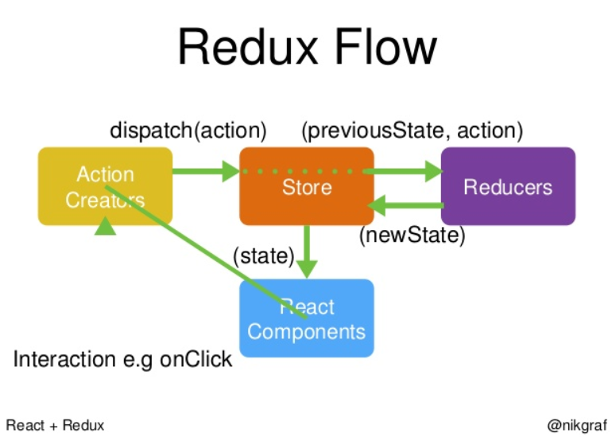

## REDUX의 핵심
action = event

reducer = event에 대한 action

Redux의 공식 문서에 의하면 Redux는 클라이언트 앱의 복잡성을 제어하기 위한 하나의 state제어 수단이라고 한다.

Redux를 제안하고 개발한 Dan Abramov는 클라이언트앱의 복잡성을 증가시키는게 Mutation과 Asynchronicity라며 그 둘을 멘토스와 콜라와 같다고 한다.

## REDUX의 원리
application 전체에는 store라는 커다란 하나의 state가 존재하는데 이것이 application의 state를 총괄한다.

이 store의 state는 그 자체를 직접 변형할 수 없고, 오직 순수 함수인 reducer로만 새로운 형태로 갈아치우는 것이 가능하다.

Reducer는 type과 payloads를 속성으로 갖는 단순 객체인 action event가 발생했을 때에만 작동하며

action evnet를 발생시키는 방법은 dispatch라는 함수에 단순 객체인 action을 넣는것으로 가능하게 한다.

## Action 이란?
'작업에 대한 정보' 를 지니고있는 객체

## Reducer 란?
'변화'를 일으키는 함수.

'이전 상태'와 ‘액션'을 받아서 '다음 상태'를 반환한다.

## Store 란?
어플리케이션의 현재상태를 지니고 있음

redux에서 Store는 단 한개만 존재

## React-Redux 란?
view 레이어 바인딩 도구

Provider는 컴포넌트에서 redux를 사용하도록 제공하는 컴포넌트

connect 함수는 컴포넌트를 redux에 연결하는 또다른 함수를 반환한다.

참고 사이트 : 

https://voidsatisfaction.github.io/2017/02/24/what-is-redux/

http://2dubbing.tistory.com/38